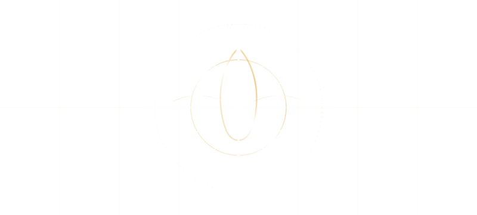
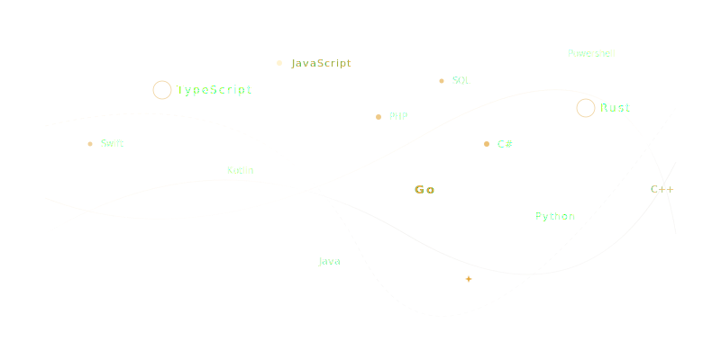
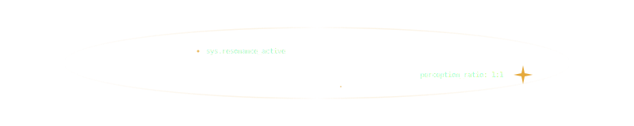

  

 

๋ ࣭ ⭑๋ ࣭ ⭑ˎˊ˗ִ ࣪𖤐࣪ ִֶָ☾.๋ ࣭ ⭑๋ ࣭ ⭑ִ ࣪𖤐☁︎ˎˊ˗ˎˊ˗࣪ ִֶָ☾.๋ ࣭ ⭑๋ ࣭ ⭑
    ˎˊ˗๋ ࣭ ⭑๋ ࣭ ⭑๋ ࣭ ⭑๋ ࣭ ⭑🪼⋆.ೃ࿔*:･ִ ࣪𖤐⋆.˚๋ ࣭ ⭑๋ ࣭ ⭑
  ࣪ ִֶָ☾..𖥔 ݁ ˖🛸── .✦ˎˊ˗

## — O Universo Conhece a Ti Mesmo, Através do Cosmos —

Enxergo a tecnologia não como um fim, mas como uma **extensão ancestral da mente humana**: um processo mecânico e infinitamente complexo que materializa a expressão intelectual do saber universal. É a ponte vetorial que conecta as histórias, os aprendizados e o legado de uma vida inteira, projetando essa essência para as próximas gerações através do silício.

> **Escrever um código**, para mim, é uma tentativa de moldar uma **consciência assistida** que se expande a partir da nossa percepção biológica; uma manipulação cirúrgica de uma matéria fluida e invisível que se molda à vontade do intelecto.

---

### 🧬 As Frequências do Código // Matéria Prima Vetorial

Os ecossistemas que modelo não são apenas sistemas operacionais; eles buscam o equilíbrio cristalino e a resiliência mutável da água. São estruturas transparentes, performáticas por natureza e destituídas de qualquer complexidade de infraestrutura que aprisione a liberdade criativa ou a pureza da ideia original.

  

---

### 📊 O Pulso Holográfico // Telemetria Operacional

  

  
  

 

  

